# 副楽 事業計画 図解（Mermaid）

副業サラリーマン専用 確定申告アプリ「副楽」の事業計画を図で整理したものです。

---

## 1. ビジネス全体フロー

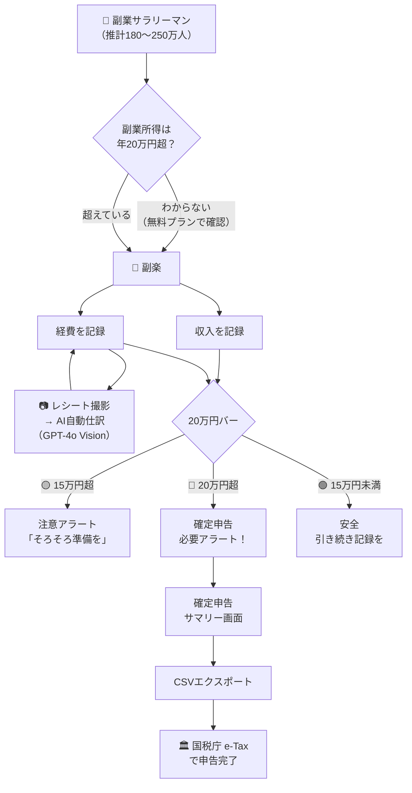

---

## 2. 市場規模（TAM / SAM / SOM）

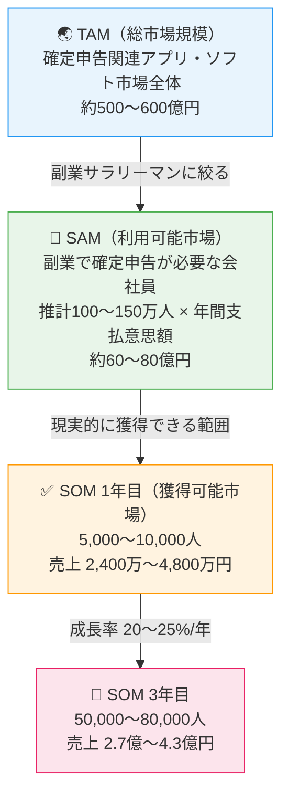

---

## 3. 競合ポジショニングマップ

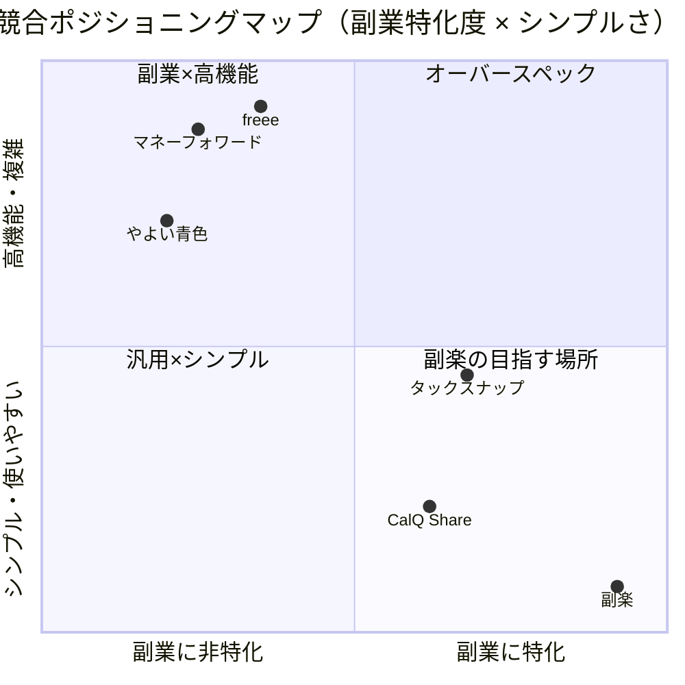

---

## 4. 価格プランと機能

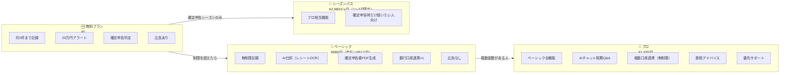

---

## 5. アプリ画面フロー（ユーザー体験）

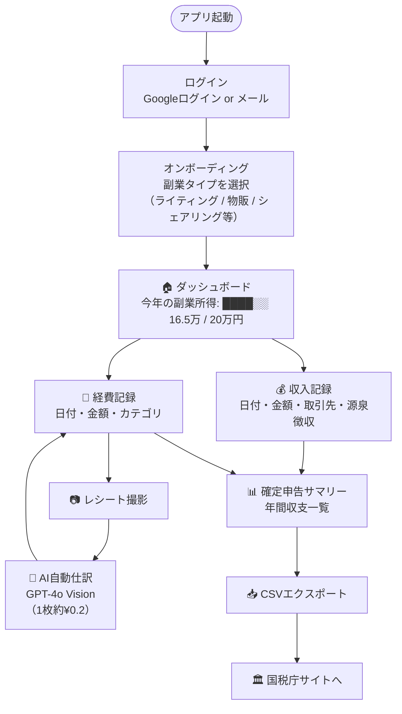

---

## 6. 8週間 開発ロードマップ

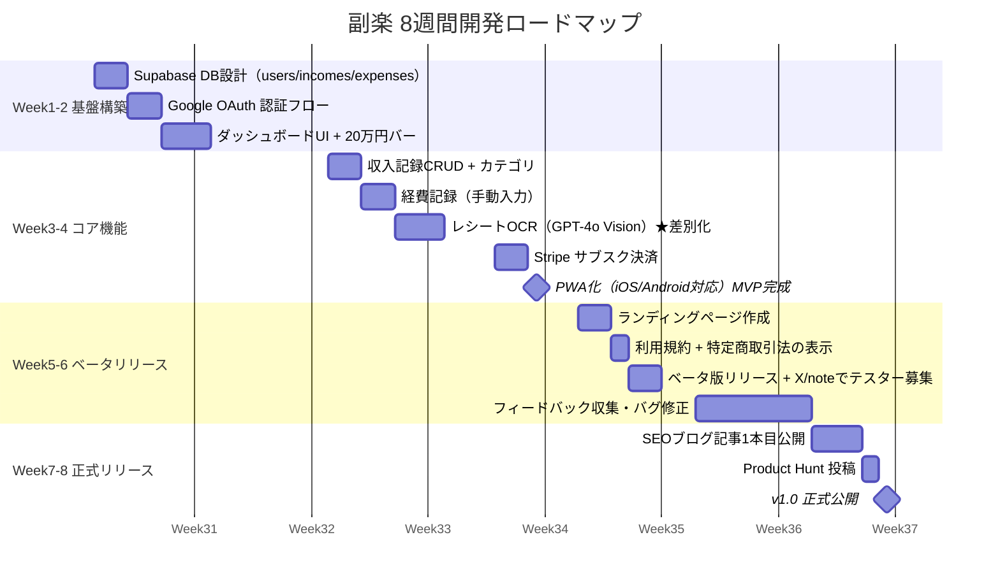

---

## 7. リリース後 バージョンロードマップ

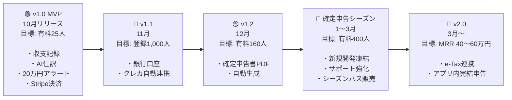

---

## 8. GTM戦略（集客チャネル）

```mermaid
mindmap
  root((副楽\n集客戦略))
    SEOブログ
      副業 確定申告 やり方
      副業 20万円 確定申告
      副業 確定申告 簡単
      freee 副業 比較記事
      税制改正 副業 影響
    X(Twitter)毎日投稿
      月・水 副業×税金Tips
      火・金 個人開発の裏話
      木 ユーザーQ&A
      朝7:30 or 夜20:00投稿
    副業コミュニティ
      note 確定申告体験記
      Zenn 技術記事
      副業Discord 無料Q&A会
      Voicy 副業チャンネル
    確定申告シーズン集中
      1月 意識喚起投稿
      2月 バズ狙い あるある
      3月 締切カウントダウン
      PR TIMES プレスリリース
      Product Hunt ローンチ
```

---

## 9. 12ヶ月 MRR 収益シミュレーション

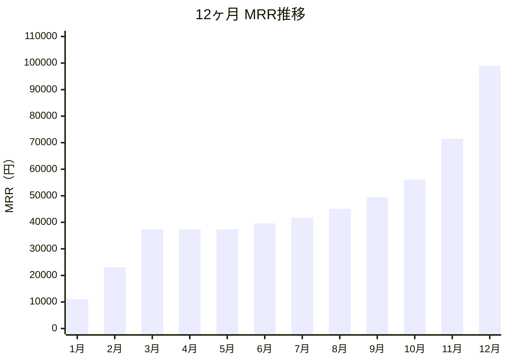

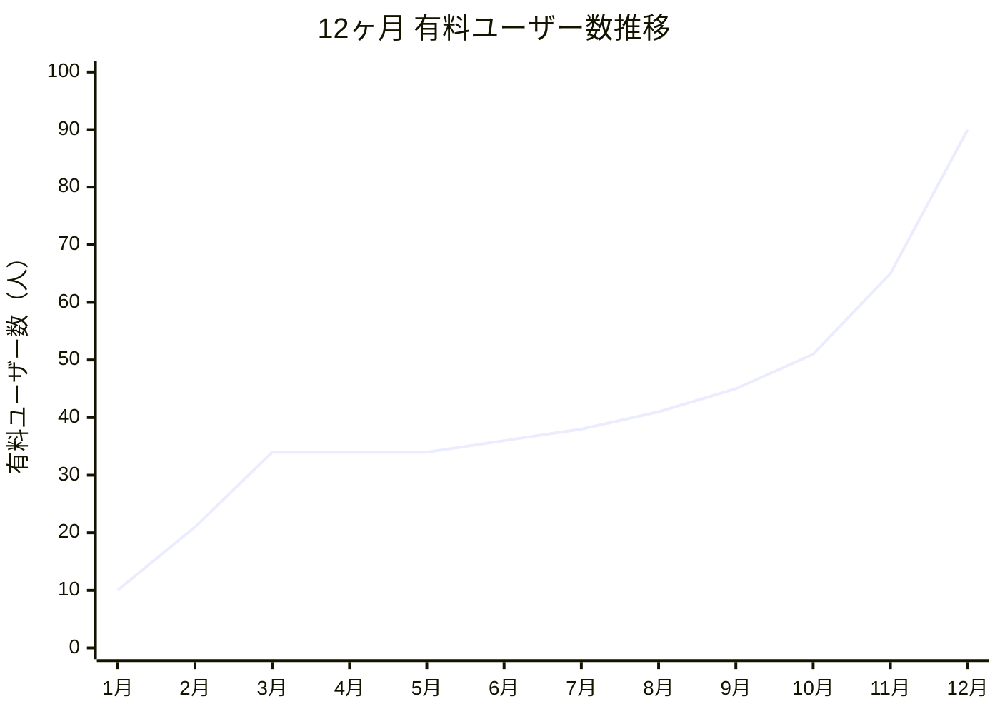

---

## 10. KPI設計と測定フロー

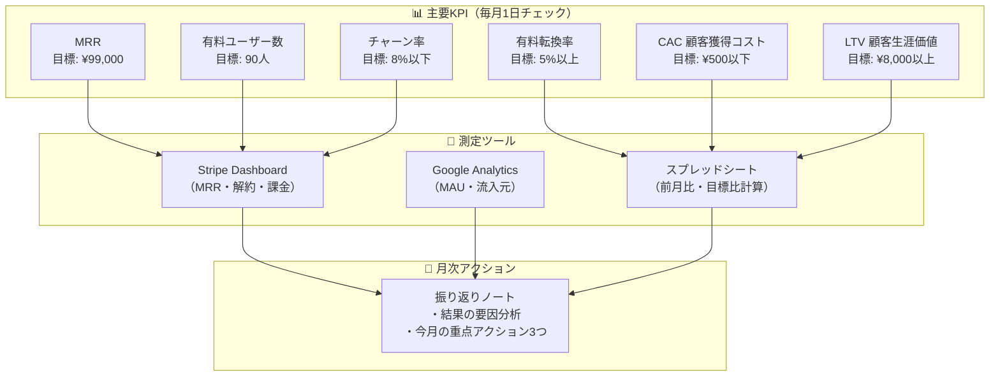

---

## 11. リスクマトリクス

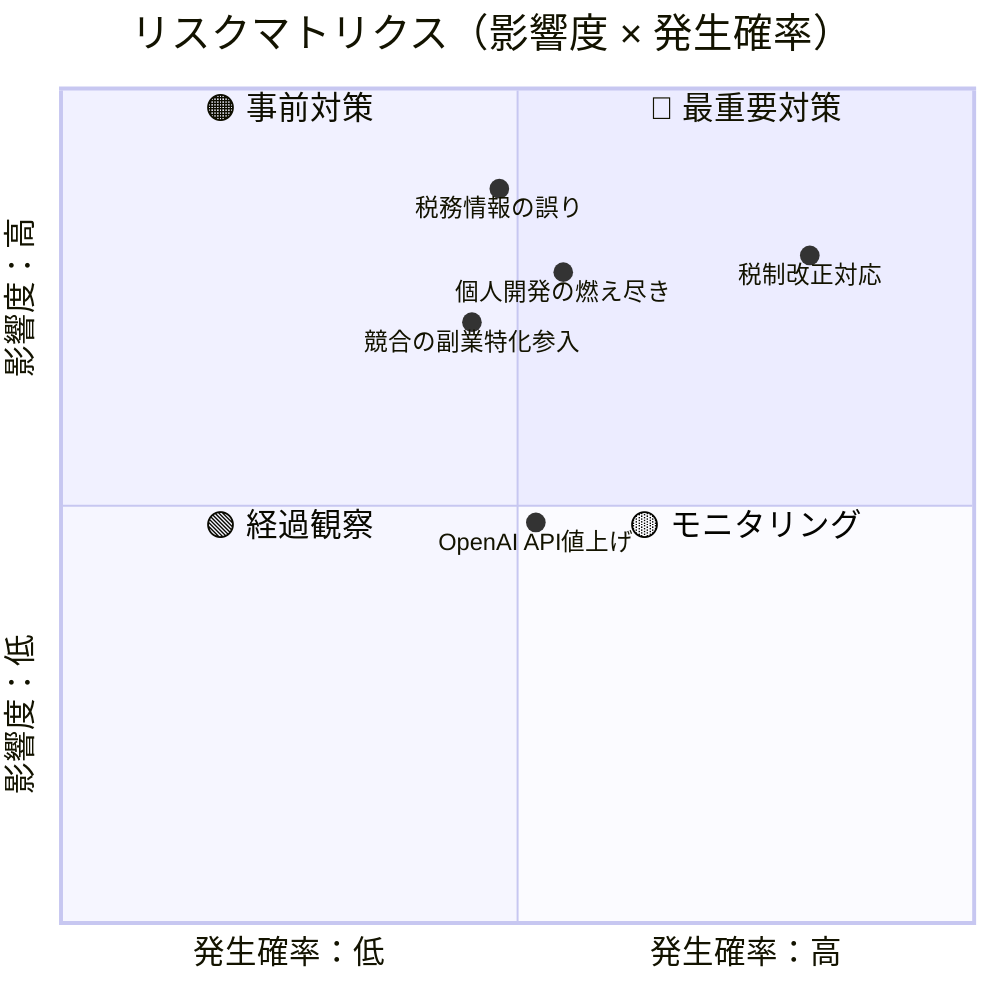

---

## 12. ステップバイステップ実行フロー

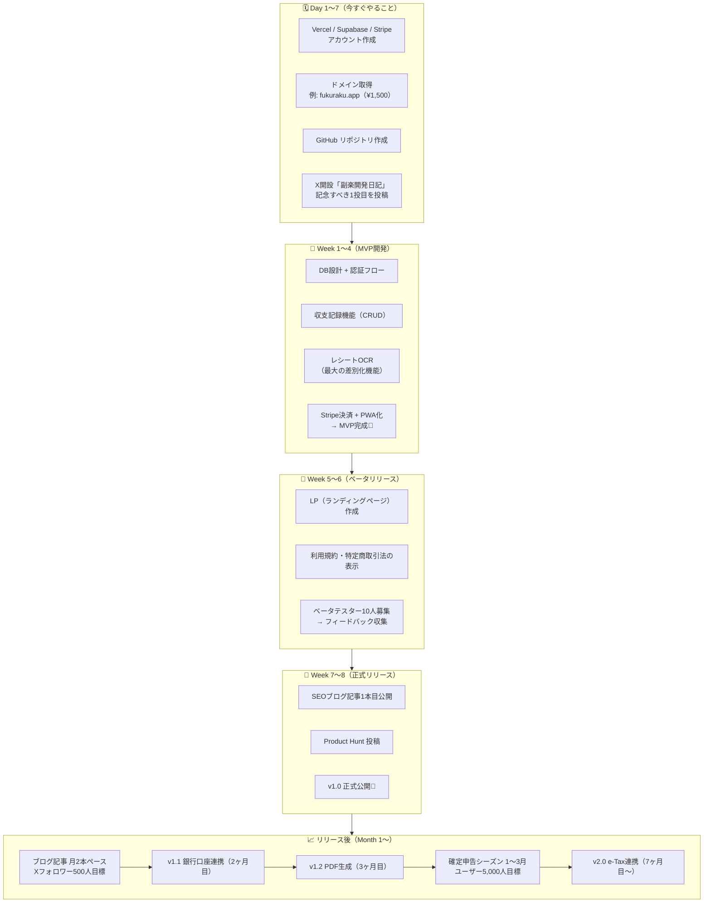

---

## 13. コスト構造と利益率

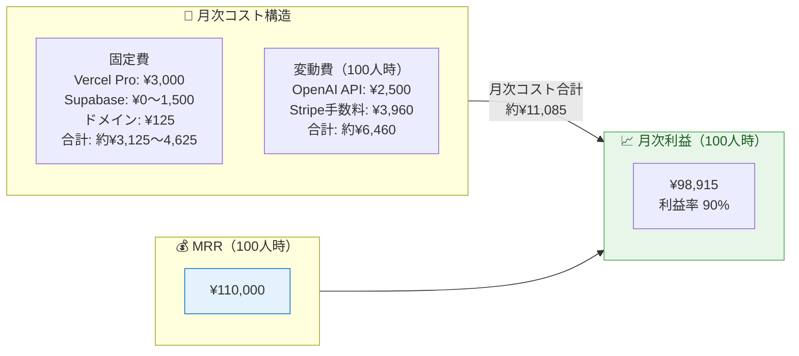

---

*図解作成：Claude Code Agent Team を活用して事業計画書から自動生成*
